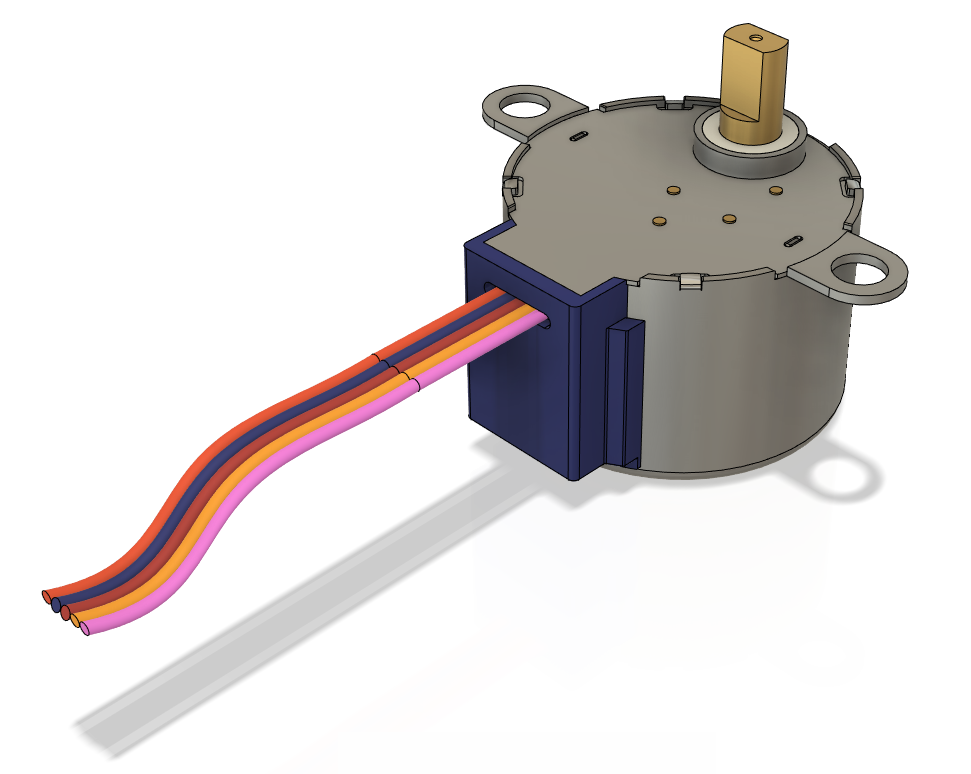
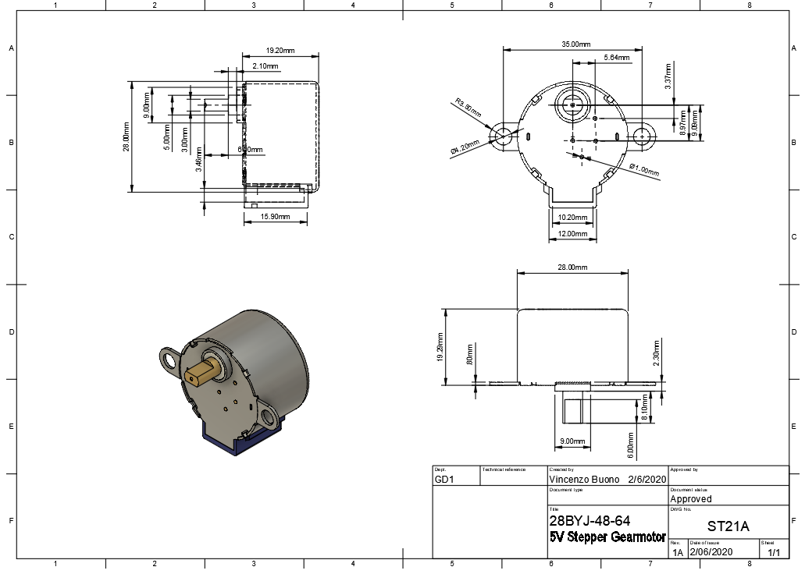
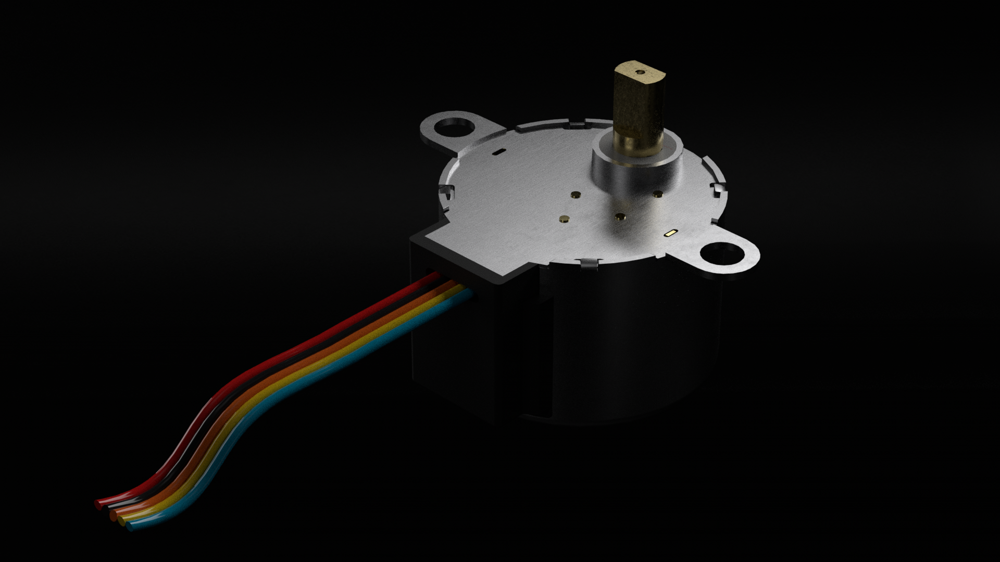

# Engineering model library <!-- omit in toc -->

> Highly detailed, mechanically accurate, engineering 3d models for mechanical constraint evaluation or visual renderings

## Table of contents <!-- omit in toc -->

- [Overview](#overview)
- [Supported formats](#supported-formats)
- [Support file conventions](#support-file-conventions)
- [Models](#models)
- [28BYJ-48-64 5V Stepper Gearmotor](#28byj-48-64-5v-stepper-gearmotor)
  - [Preview](#preview)
  - [Drawings](#drawings)
  - [Renders](#renders)
- [License](#license)

## Overview

This repository contains a selection of highly detailed, 1:1 mechanically accurate 3D models for rendering, MCAD integration or engineering simulations. Each model is provided in the following supported formats (Please view [Supported formats](#supported-formats)) with relative drawings and tolerance whereas available.

## Supported formats

Currently each 3D model will be provided in the following formats:

- [x] STEP (.step, .stp)
- [x] IGES (.iges, .igs)
- [x] STL (.stl)
- [x] SAT (.sat)
- [x] SMT (.smt)
- [ ] Invetor (.ipt, .iam)
- [ ] Obj (.obj)

Currently drawings supported formats:

- [x] DWG (.dwg)
- [x] PDF (.pdf)
- [x] PNG (.png)
- [ ] CSV (.csv)

## Support file conventions

Each model's resource files are provided within a folder named after it's EAN, whereas available, and structured as follow:

- XXX.step
- XXX.iges
- ...
- XXX-drawing.dwg
- XXX-drawing.pdf
- ...
- XXX-render01.png
- XXX-render02.png
- ...
- XXX-preview.png

## Models

The currently available models are listed below. The list is subjected to change.

## 28BYJ-48-64 5V Stepper Gearmotor

### Preview

### Drawings

### Renders

## License

[MIT](http://opensource.org/licenses/MIT)